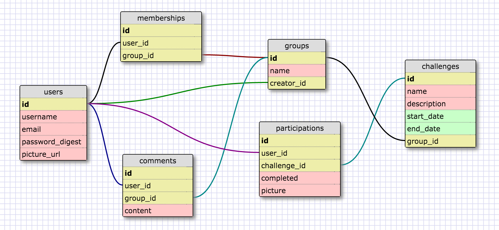

# grouVie

##Description
grouVie is a mobile app built with React Native and Ruby on Rails in 8 days as a final project at Dev Bootcamp Chicago. The app allows users to create groups of like-minded friends and to post challenges within the group. If other members accept that challenge, they can announce its completion by posting a selfie using the in-app camera function. The app also features in-group instant messaging.

This respository houses the grouVie API - for the front-end mobile application, see [grouVie-react](https://github.com/msosland/grouVie-react). The back-end was built using Ruby 2.2.1 and Rails 4, and we used [Paperclip](https://github.com/thoughtbot/paperclip) and Amazon S3 for image hosting.

##Contributors

* [Alana Hanson](https://github.com/alanahanson)
* [Michal Klimek](https://github.com/KlimekM)
* [Lauren Reid](https://github.com/tomorrow-lauren)
* [Marshall Sosland](https://github.com/msosland)

##Schema

